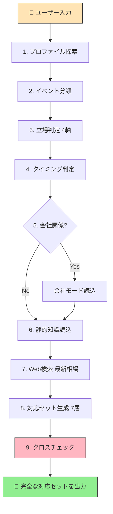

<p align="center">
  
</p>

<h1 align="center">冠婚葬祭レスキュー<br><sub>ceremonial-rescue-jp</sub></h1>

<p align="center">
  <strong>「何をすればいいの？」を、一言で解決する Agent Skill</strong><br>
  葬儀・結婚式・お中元お歳暮・入学祝い・還暦 —— 日本の冠婚葬祭すべてに対応
</p>

<p align="center">
  <a href="https://github.com/TadFuji/ceremonial-rescue-jp/actions/workflows/ci.yml"></a>
  <a href="LICENSE"></a>
  
  
  
  
  
  
</p>

---

## 目次

- [なぜ「アプリ」ではなく「スキル」なのか](#なぜアプリではなくスキルなのか)
- [このスキルが解決する問題](#このスキルが解決する問題)
- [コア設計思想](#コア設計思想)
- [クイックスタート](#クイックスタート)
- [主要な技術的特徴](#主要な技術的特徴)
- [ディレクトリ構成](#ディレクトリ構成)
- [ワークフロー：9ステップの自律処理](#ワークフロー)
- [ハイブリッド知識アーキテクチャ](#ハイブリッド知識アーキテクチャ)
- [対応イベント一覧](#対応イベント一覧)
- [テスト結果](#テスト結果)
- [使用例](#使用例)
- [補助スクリプト](#補助スクリプト)
- [制約事項](#制約事項)
- [ライセンス](#ライセンス)

---

## なぜ「アプリ」ではなく「スキル」なのか

### 🤔 アプリの限界

冠婚葬祭アプリは世の中にいくつか存在します。しかし、アプリには根本的な限界があります。

| アプリの限界 | 具体的な問題 |
|---|---|
| **固定的なUI** | 入力フォームの選択肢に「自分のケース」がない。「同僚の親が家族葬で、しかも自分はキリスト教徒で…」のような複合条件に対応できない |
| **一方通行の情報提供** | データベースから引っ張って表示するだけ。ユーザーの状況を能動的に理解しようとしない |
| **文書生成の限界** | 「弔電の文面を作って」と頼めない。テンプレートを渡されて自分で埋める必要がある |
| **コンテキストの断絶** | 久しぶりに開くアプリに、自分の役職や居住地域は入っていない。毎回ゼロから入力 |
| **チャネルの壁** | メール文面を作っても、LINE用に短くする機能はない。口頭セリフは完全に対象外 |

### ✅ スキルだからこそできること

Agent Skill は **AIの推論能力を前提とした設計** ができます。これは、データベース検索型のアプリとは根本的に異なる設計思想です。

| スキルの強み | 実現していること |
|---|---|
| **自然言語入力** | 「同僚の田中さんのお父さんが亡くなったらしい」— この一文から、イベント種別（弔事）、立場（同僚）、関係（相手の親）、距離感（普通）を**AIが自律的に推定** |
| **ワークスペース自律探索** | AIがユーザーのワークスペースファイルを自動的に探索し、氏名・勤務先・役職・居住地域を発見。**質問ゼロ**で最適な対応を出力 |
| **立場判定エンジン** | 4軸（自分の立場 × 相手との関係 × 距離感 × 役割）の判定を**AIの推論で実行**。フォーム選択では不可能な粒度 |
| **マルチチャネル文面生成** | 同じ内容を、正式メール(.docx)→ LINE(300字以内)→ 社内Slack → 口頭セリフ(30字以内)に**形式変換** |
| **NGワード自動修正** | 生成した文面に含まれるNGワードを**スクリプトで検出し、代替表現に自動置換**。AIだけに頼らない二重チェック |
| **ハイブリッド知識** | 不変の作法知識(静的DB)とリアルタイム相場(Web検索)の**併用戦略**。アプリでは更新が止まりがちな情報を常に最新に |
| **プラットフォーム非依存** | Claude, OpenClaw, Antigravity — **どのAIプラットフォームでも動作**。アプリのようにインストールもアカウント作成も不要 |

### 💡 スキルだからこそ可能な体験

```
ユーザー: 「取引先の社長のお母様が亡くなったらしい」

↓ 以下をAIが自律的に実行（ユーザーの追加入力ゼロ）

1. ワークスペースからユーザーのプロファイルを発見
   → 氏名: 山田太郎、ABC株式会社 営業部 部長、大阪府在住

2. イベント判定 → 弔事（訃報）
3. 立場判定 → 取引先 × 社長の親 × 形式的 × 会社対応
4. 会社モード → 会社対応レイヤーを選択（役職が部長→代表対応の可能性）
5. 地域判定 → 大阪（関西）→ 黄白水引の可能性を注記
6. 静的知識読み込み → のし袋、焼香手順、口頭セリフ、NGワード
7. Web検索 → 「香典 相場 取引先の親 2026」で最新相場を取得
8. 対応セット7層を生成 → 金額ガイド、弔電文面、社内通知、口頭セリフ...
9. NGワードチェック → 浄土真宗対応含むフルスキャン

結果: 質問ゼロで、文書ファイル付きの完全な対応セットを即座に出力
```

**アプリでは「取引先の社長のお母様が亡くなったらしい」というたった一文から、ここまでの対応を自動生成することは不可能です。** スキルとAIの組み合わせだからこそ実現できる体験です。

---

## このスキルが解決する問題

日本人が他人の冠婚葬祭に直面したとき、4つの苦痛に襲われます。

| 苦痛 | 現状 | このスキルの解決 |
|------|------|-----------------|
| 😰 **正解がわからない** | 金額・敬語・マナー・服装の「正解」が、立場・関係性・宗派・地域・タイミングで変わる | 4軸の立場判定エンジンが自動的に最適解を導出。判断理由まで明示 |
| 😵 **情報が散在している** | Google検索で10サイト巡回しても「自分のケース」の答えがない | 一言入力で全情報をパッケージ化。7層の対応セットとして一括出力 |
| 😨 **文面を書けない** | 弔電、欠勤メール、スピーチ…慣れない文面を短時間で書く恐怖 | マルチチャネル文面をAIが生成。メール・LINE・口頭、すべて対応 |
| 😓 **その場で何を言えばいいかわからない** | 受付・焼香・遺族への声かけ…文書以前に「口頭の一言」が出てこない | 場面別・距離感別の口頭セリフを「そのまま言える形」で提供 |

---

## コア設計思想

### 1. 「ガイド」ではなく「レスキュー」

ユーザーが求めているのは「冠婚葬祭マナーガイド」ではありません。**パニック状態の人が「これで大丈夫」という確信を最短で得ること**が目的です。文書生成もマナー案内も、その確信を支える「手段」に過ぎません。

### 2. 自律解決の徹底

ユーザーに質問しない。Web検索が失敗しても止まらない。プロファイルが見つからなくても正常動作する。**何があっても必ず完全な対応セットを届ける**ことが鉄則です。

### 3. 二重・三重の安全策

文面の品質は、AI生成だけに頼りません。

```
AI生成 → NGワードスクリプト → 金額バリデーション → 日付・六曜チェック → 最終クロスチェック
```

Pythonスクリプトによるプログラム的検証を通過しなければ、出力しません。

---

## クイックスタート

### セットアップ

1. このリポジトリをクローンまたはダウンロード
2. `ceremonial-rescue-jp/` フォルダをワークスペースのスキルディレクトリに配置
3. AIプラットフォーム（Claude, OpenClaw, Antigravity 等）がスキルを自動認識

### 最初の質問

AIに冠婚葬祭の質問をするだけです：

> 「同僚のお父さんが亡くなった。何をすればいい？」

スキルが自動トリガーされ、質問ゼロで完全な対応セットが出力されます。
詳しい使用例は[こちら](#使用例)。

### 前提条件

- Python 3.8以上（バリデーションスクリプト実行時）
- 外部ライブラリ不要（標準ライブラリのみ使用）

---

## 主要な技術的特徴

### 🗺️ 地域差への動的対応

冠婚葬祭のマナーは、全国一律ではありません。このスキルは地域差を**静的知識 + Web検索の両面**で対処します。

```
references/etiquette.md → 不変の地域差パターン（基礎知識）
  北海道: 会費制の結婚式が一般的
  関西:   黄白の水引を使う地域あり
  名古屋: 婚礼が派手（菓子まきの文化）
  九州:   即日返し（当日に香典返し）
  沖縄:   相場が低め、結婚式は大規模(200〜300名)

Web検索 → 最新の地域事情を補完
  「{地域名} {イベント} 慣習 最新」で検索
```

ユーザーの居住地域は、プロファイル探索から自動取得。**地域が大阪なら関西ルールを、北海道なら会費制を、自動で適用**します。

### ⛩️ 宗派による差異の安全処理

宗派によるNGは、日本の冠婚葬祭で**最も致命的な間違い**の温床です。

> 例: 「ご冥福をお祈りします」は日本で最もよく使われる弔意のフレーズですが、**浄土真宗では禁忌**です（即身成仏の教義に反する「冥途」の概念を含むため）。

このスキルは、宗派別のNGワード・表書き・焼香作法・代替表現のすべてを `references/ng_words.md` と `references/etiquette.md` に体系化し、`scripts/ng_word_checker.py` で機械的にチェックします。

対応宗派: **仏式(一般)・浄土真宗(本願寺派/大谷派)・神式・キリスト教(カトリック/プロテスタント)・無宗教**

### 🏢 会社レイヤーの3段判定

個人の冠婚葬祭と、会社の冠婚葬祭は別物です。このスキルは `references/company_mode.md` に会社対応の独立知識ベースを持ち、3レイヤーで判定します。

| レイヤー | 判定条件 | 対応 |
|---|---|---|
| **個人対応** | 個人的な関係がある | 個人名義の香典・メッセージ |
| **部署対応** | 同じ部署 | 連名の香典、部署弔電 |
| **会社対応** | 役員・重要取引先 | 会社名義の香典・供花・弔電 + 社内通知 |

ユーザーの役職情報（プロファイル探索で取得）と合わせて、**「部長」以上なら代表対応の可能性を自動提案**します。

### 🔢 金額の厳密バリデーション

冠婚葬祭の金額には暗黙のルールがあります。`scripts/amount_validator.py` が以下を自動チェック:

- ❌ **偶数** → 「割り切れる = 縁が切れる」（弔事・慶事共通）
- ❌ **4を含む金額** → 「死」の連想
- ❌ **9を含む金額** → 「苦」の連想
- ✅ **奇数かつ相場範囲内** → 合格

### 📅 日付・六曜の整合性チェック

`scripts/date_validator.py` が六曜（ろくよう）の整合性を検証:

- ⚠️ **友引 × 葬儀** → 友を引く（連れていく）意味で忌避
- ⚠️ **仏滅 × 結婚式** → 慶事には不向き

---

## ディレクトリ構成

```
ceremonial-rescue-jp/
│
├── SKILL.md                         # メイン指示書 (354行)
│   ├── §2  ユーザープロファイル自律探索
│   ├── §3  イベント分類（弔事/慶事/季節/祝い）
│   ├── §4  立場判定エンジン（4軸）
│   ├── §5  会社関係モード
│   ├── §6  ハイブリッド知識戦略
│   ├── §7  対応セット7層構成
│   ├── §8  ファイル生成
│   ├── §9  クロスチェック＆バリデーション
│   └── Gotchas（14項目の注意事項）
│
├── references/                      # 不変の作法知識（静的DB）
│   ├── etiquette.md                 # のし袋, 焼香手順, 口頭セリフ,
│   │                                # 服装, 招待状返信, 行動NG,
│   │                                # スピーチ構成, 地域差 (337行)
│   ├── ng_words.md                  # NGワード統合辞書 (184行)
│   │                                # 弔事/慶事/お祝い/宗派別NG＋
│   │                                # 100語超の代替表現
│   └── company_mode.md              # 会社対応の3層フレーム,
│                                    # 社内通知テンプレート,
│                                    # HR確認チェックリスト
│
├── scripts/                         # バリデーション・テスト
│   ├── ng_word_checker.py           # NGワード自動チェッカー
│   ├── amount_validator.py          # 金額妥当性チェッカー
│   ├── date_validator.py            # 日付・六曜チェッカー
│   ├── test_comprehensive.py        # 包括テスト (68ケース)
│   └── test_50_prompts.py           # 実プロンプトテスト (50シナリオ)
│
├── assets/templates/                # 文書テンプレート (12ファイル)
│   ├── condolence_email.md          # 弔事メール
│   ├── absence_notice.md            # 欠勤連絡
│   ├── telegram_funeral.md          # 弔電
│   ├── telegram_wedding.md          # 祝電
│   ├── speech_template.md           # スピーチ原稿
│   ├── mourning_postcard.md         # 喪中はがき
│   ├── company_notice.md            # 社内通知
│   ├── belated_condolence.md        # 後日お悔やみ
│   ├── checklist_template.md        # チェックリスト
│   ├── seasonal_gift.md             # 季節の贈り物
│   ├── new_year_card.md             # 年賀状
│   └── celebration_message.md       # お祝いメッセージ
│
└── CHANGELOG.md                     # バージョン履歴 (v1→v2→v2.1→v3)
```

> **📦 `ceremonial-rescue-jp.skill`** — 上記ディレクトリをパッケージ化したスキルファイル（リポジトリルートに配置）。対応プラットフォームへドラッグ＆ドロップでインストール可能です。

---

## ワークフロー

ユーザーの一言入力から、以下の9ステップを**すべて自律的に**実行します。



### 対応セット7層

| 層 | 内容 | 出力形式 |
|---|---|---|
| 🔍 確認事項 | 宗派、式形式、日時、場所 | チャット内テキスト |
| 📋 アクション | 🔴今すぐ / 🟡今日中 / 🟢数日以内 | 時系列チェックリスト |
| 💰 金額ガイド | 推奨額 + 幅 + 判断理由 + 出典 | Web検索結果 + スクリプト検証 |
| 📝 文面 | メール / LINE / Slack / 弔電・祝電 | .docx + チャット内テキスト |
| 🗣️ 口頭セリフ | 受付、遺族への声かけ、電話での弔意 | そのまま言える形 (≤30字) |
| 👔 服装・持ち物 | チェックリスト形式 | .pdf |
| ⚠️ NG警告 | 言葉のNG + 行動のNG | スクリプト検証済み |

---

## ハイブリッド知識アーキテクチャ

v3.0 の最大の特徴は、**不変知識と変動情報の明確な分離**です。

```
┌─────────────────────────────────────────────────┐
│              ハイブリッド知識戦略                   │
│                                                   │
│  ┌──────────────────┐  ┌──────────────────────┐  │
│  │  📚 静的知識      │  │  🔍 Web検索          │  │
│  │  (references/)    │  │                      │  │
│  │                   │  │  金額の最新相場       │  │
│  │  のし袋の書き方   │  │  人気の贈り物        │  │
│  │  焼香の手順       │  │  年ごとの干支        │  │
│  │  NGワード辞書     │  │  最新サービス情報     │  │
│  │  宗派別ルール     │  │  地域の最新動向       │  │
│  │  口頭セリフ       │  │                      │  │
│  │  服装・持ち物     │  │                      │  │
│  │  会社対応フロー   │  │                      │  │
│  │  地域差パターン   │  │                      │  │
│  │  スピーチ構成     │  │                      │  │
│  │                   │  │                      │  │
│  │  ⏳ 変わらない     │  │  🔄 毎年変わる      │  │
│  └──────────────────┘  └──────────────────────┘  │
│          │                       │                │
│          └───────┐   ┌───────────┘                │
│                  ▼   ▼                            │
│          ┌──────────────────┐                     │
│          │  統合 → 対応セット │                     │
│          └──────────────────┘                     │
└─────────────────────────────────────────────────┘
```

**なぜハイブリッドなのか？**

| 方式 | メリット | デメリット |
|---|---|---|
| 全静的DB | 高速・安定 | 金額が古くなる。「2024年のお中元人気ランキング」は答えられない |
| 全Web検索 | 常に最新 | 検索失敗時に何も返せない。信頼性の低い情報源に依存するリスク |
| **ハイブリッド** ✅ | **静的DBで確実な基盤 + Webで最新情報を補完** | — |

このスキルは v2.0（全Web検索）を経て、v3.0 でハイブリッドに到達しました。**Web検索が全滅しても、references/ の知識だけで完全な対応セットを返せる**安全設計です。

---

## 対応イベント一覧

### 弔事

| シーン | 分岐 |
|---|---|
| 通夜・葬儀に参列 | フル対応セット（香典・服装・作法・文面） |
| 家族葬と言われた | 参列は控える → 弔電・供花・後日弔問の判断 |
| 香典辞退と言われた | 香典以外の弔意の示し方 |
| 後日知った | 経過日数に応じた対応分岐 |
| SNSで知った | 直接連絡すべきか、コメントで済ませるかの判断 |
| 会社として対応 | 社内通知 + 会社名義の香典・供花・弔電 |

### 慶事

| シーン | 分岐 |
|---|---|
| 結婚式に出席 | ご祝儀・服装・返信はがき・当日マナー |
| 結婚式を欠席 | 欠席返信の文面 + ご祝儀を送るか |
| 式なし婚の報告 | 祝い方の選択肢 |
| 会費制の結婚式 | ご祝儀不要の判断 |
| スピーチを頼まれた | 時間指定に合わせた原稿生成 |

### 季節行事

| シーン | 対応 |
|---|---|
| お中元 | 時期(地域差あり) + 品物選び + 送り状 |
| お歳暮 | 時期 + 品物選び + 送り状 |
| 年賀状 | 文面 + 喪中確認 + 投函時期 |

### お祝い

| シーン | 対応 |
|---|---|
| 快気祝い | お見舞いの半返し〜1/3。消え物が定番 |
| 入学祝い | 学校レベル × 関係性で金額変動 |
| 七五三 | 親族間が一般的。準備ガイド |
| 還暦祝い | 赤いもの贈呈の慣習。古希・喜寿・米寿も同フロー |

---

## テスト結果

2つのテストスイートで**合計134チェック、全パス**を確認済みです。

### test_comprehensive.py (68テスト)

スクリプトのロジック検証を網羅:

- ✅ NGワードチェッカー: 弔事/慶事/お祝い/宗派別の全パターン
- ✅ 金額バリデーター: 偶数NG / 4・9チェック / 範囲チェック / 全イベントタイプ
- ✅ 日付バリデーター: 六曜チェック / 日付形式検証
- ✅ 新規イベント(v2.1追加): お中元/お歳暮/快気祝い/入学祝い/七五三/還暦

### test_50_prompts.py (66チェック / 50シナリオ)

実際のユーザープロンプトを模擬した統合テスト:

- ✅ 弔事14シナリオ（一般参列、家族葬、香典辞退、後日、SNS、会社対応…）
- ✅ 慶事12シナリオ（出席、欠席、スピーチ、式なし、会費制…）
- ✅ 季節行事9シナリオ（お中元、お歳暮、年賀状…）
- ✅ お祝い8シナリオ（出産、入学、七五三、還暦…）
- ✅ エッジケース7シナリオ（最小情報、複合条件、同時イベント…）
- ✅ references/ファイル検証3チェック（etiquette.md, ng_words.md, company_mode.md の存在・内容検証）

---

## 使用例

### 基本（弔事）

```
ユーザー: 同僚のお父さんが亡くなった。何をすればいい？
```

→ 立場判定(同僚×親×普通×参列者) → 香典5,000円推奨 → 欠勤メール → 通夜マナー → 口頭セリフ → 服装チェックリスト → NG警告

### 慶事（スピーチ）

```
ユーザー: 友人の結婚式でスピーチを頼まれた。5分で。
```

→ 5分=約1200〜1500字 → エピソード構成 → NGワード除外(重ね言葉、別れ系) → .docx出力

### 会社関係

```
ユーザー: 取引先の社長のお母様が亡くなったらしい
```

→ 会社モード発動 → 3レイヤー判定(会社対応) → 社内通知文 → 弔電 → 供花手配フロー → 総務確認リスト

### 現代的なケース

```
ユーザー: 同僚が家族葬でと言っている。何かした方がいい？
```

→ 「参列は控える」をデフォルト → 弔電・後日弔問の提案 → 弔意の示し方ガイド

### 最小入力

```
ユーザー: 香典っていくら？
```

→ 情報不足を検出 → 1問だけ質問(選択肢形式) → 回答後にフル対応セット出力

---

## 補助スクリプト

### ng_word_checker.py

生成テキストに含まれるNGワードを検出し、代替表現を提案。

```bash
# 弔事メッセージのチェック
python ng_word_checker.py --text "ご冥福をお祈りします" --type funeral
# → ⚠️ 検出: 浄土真宗で「ご冥福」はNG → 代替: 「お悔やみ申し上げます」

# 宗派指定チェック
python ng_word_checker.py --text "メッセージ" --type funeral --sect 浄土真宗

# 慶事チェック
python ng_word_checker.py --text "メッセージ" --type wedding
```

### amount_validator.py

金額の文化的妥当性を検証。

```bash
# 弔事の金額チェック
python amount_validator.py --amount 5000 --type funeral --relationship colleague --target parent
# → ✅ 5,000円: 相場範囲内 (3,000〜10,000円)

# 偶数チェック
python amount_validator.py --amount 20000 --type wedding
# → ❌ 20,000円: 偶数は「割り切れる=縁が切れる」ため避ける
```

### date_validator.py

日付と六曜の整合性を検証。

```bash
python date_validator.py --date 2026-04-15 --event funeral
# → ⚠️ 友引: 葬儀を避ける慣習あり
```

---

## 制約事項

| 制約 | 理由 |
|---|---|
| 法的助言は行わない | 相続・遺言 → 「専門家にご相談ください」 |
| 宗教的な価値判断は行わない | 全宗派を等価に扱う |
| 金額は「一般的な相場」として提示 | 「絶対的な正解」とは表現しない |
| 医療・介護の助言は行わない | 専門家領域 |

---

## バージョン履歴

| バージョン | 主要変更 |
|---|---|
| **v1.0** | 初版。葬儀・結婚式に対応。静的知識ベース6ファイル |
| **v2.0** | Web検索ベースへ全面転換 |
| **v2.1** | 6つの新イベント追加（お中元、お歳暮、年賀状、快気祝い、入学祝い、還暦祝い） |
| **v3.0** | **ハイブリッドアーキテクチャ**。不変知識は静的DB + 変動情報のみWeb検索。テスト134件全パス |

---

## 詳細仕様書

設計思想・立場判定エンジンの全ロジック・テストケース定義・ロードマップの詳細は [冠婚葬祭レスキュー_仕様書v3.0.md](冠婚葬祭レスキュー_仕様書v3.0.md) を参照してください。

---

## ライセンス

[MIT License](LICENSE)

---

<p align="center">
  <a href="CONTRIBUTING.md">Contributing</a> ·
  <a href="CODE_OF_CONDUCT.md">行動規範</a> ·
  <a href="SECURITY.md">セキュリティ</a>
</p>
